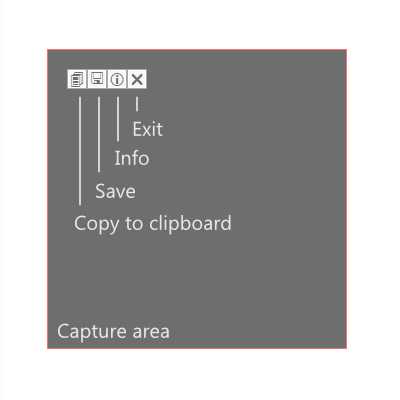

# xtract

A lightweight screenshot tool for Windows, written in x86 (fasm). Can't get more simple than this.

## Prebuilt releases

[Latest version](https://github.com/lunarflint/xtract/releases/download/Latest/xtract-latest.zip)

## Build instructions

- get a copy of flat assembler at `https://flatassembler.net/download.php`
- build the source code with `fasm.exe` or (`fasmw.exe` if you want some UI)
